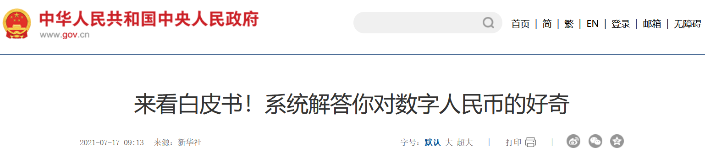
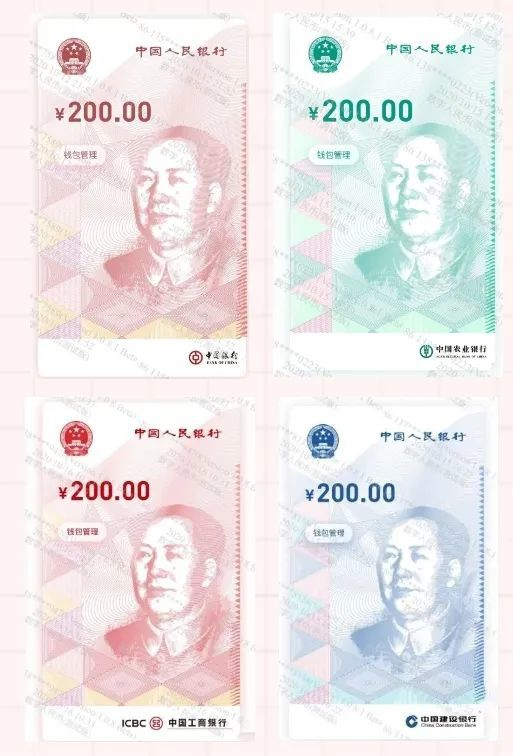
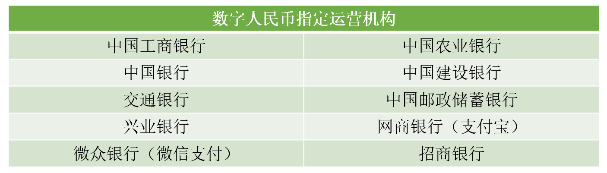

# 一文解答你对“数字人民币”的所有问题

  

## 数字人民币是什么？
数字人民币是央行发行的法定货币，和实物人民币等价。

  

## 为什么有数字人民币？
我相信大家一定有这样的困惑，既然已经有了微信、支付宝等电子支付手段，为什么还得有数字人民币呢？答案就是金融安全，微信、支付宝说白了还是第三方的科技公司，数字人民币由央行发行。
## 数字人民币有什么特点呢？
1. 没有利息。因为相当于实体人民币，所以没有利息。这也是最关键的一条，所以大家如果有想法要把钱换成数字人民币要考虑清楚。
2. 零售。暂时只对社会公众提供，满足大家的日常支付的需要，金融机构之间不用数字人民币。
3. 小额匿名、大额依法可溯。
4. 中心化。由央行直接发行，并且可以控制发行数量。和比特币这种去中心化、并且数量有限的数字货币不同。
5. 双层运营。央行负责管理和宏观审慎，商业银行和指定机构负责向社会公众提供数字人民币兑换和流通服务。

  

## 如何使用
手机下载“数字人民币”APP使用就好，操作很简单，打开就会用。
## 总结
数字人民币暂时还处于推广阶段，他的安全性完全没啥问题，可惜没有利息，放在支付宝和微信钱包中的钱起码还有活期利息，关于匿名的优势，大多数人也用不到，而且暂时很多店面还没有推广，不过一些商家：例如美团、京东等会有一些数字人民币的一些优惠券，算是为数不多的使用数字人民币的福利了。